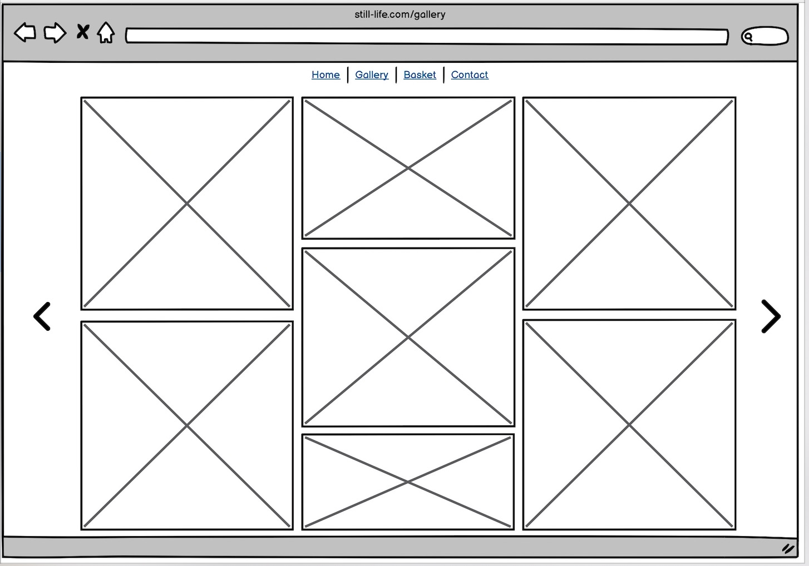

# STILL LIFE

## Outline: 

'still life' is a photography site showcasing my own photography (which helpfully sidesteps copyright issues related to using other people's photography). There are 3 pages of content. Text is kept to a minimum for stylistic reasons so as to keep the focus on the images.

A contact form is provided for users to ask questions or comment, with a view to providing prints of photographs, or organising commissions or collaborations. 

# Live site
https://caketaster.github.io/Portfolio-Project-1---still-life/

# Repository
https://github.com/caketaster/Portfolio-Project-1---still-life

# Author
Benjamin Norman
https://github.com/caketaster

# Table of Contents

- [STILL LIFE](#still-life)
  * [Outline:](#outline-)
- [Live site](#live-site)
- [Repository](#repository)
- [Author](#author)
- [Table of Contents](#table-of-contents)
- [UX](#ux)
- [Target Audience](#target-audience)
- [Project Goals](#project-goals)
- [User Stories](#user-stories)
  * [Site User Stories](#site-user-stories)
- [Design Choices](#design-choices)
  * [Colours](#colours)
  * [Typography](#typography)
  * [Imagery](#imagery)
  * [Animations and Transitions](#animations-and-transitions)
- [Site Structure](#site-structure)
- [Wireframes](#wireframes)
- [Features](#features)
  * [Implemented Features](#implemented-features)
    + [Homepage](#homepage)
    + [Gallery](#gallery)
    + [Contact page](#contact-page)
    + [Thank you page](#thank-you-page)
    + [404 page](#404-page)
  * [Future Features](#future-features)
- [Testing](#testing)
- [Validation Testing](#validation-testing)
  * [CSS Validation](#css-validation)
  * [HTML Validation](#html-validation)
  * [Compatibility and Responsive Testing](#compatibility-and-responsive-testing)
  * [Lighthouse testing:](#lighthouse-testing)
- [Defects](#defects)  
  * [Outstanding Defects](#outstanding-defects)
- [Deployment](#deployment)
  * [Production](#production)
- [Credits](#credits)
  * [Media](#media)

<small><i><a href='http://ecotrust-canada.github.io/markdown-toc/'>Table of contents generated with markdown-toc</a></i></small>

# UX

 # Target Audience
 [Film] photography enthusiasts, people looking for photographic art prints to hang on their walls, photographers looking for collaborative projects, or anyone who would be interested in photographic commissions in the style presented. As such I aimed for a dark, intuitive, minimalist design with little text and a focus on the images. 

 # Project Goals
 To present images to the target audience in a stylish and intuitive way.
 To develop my own HTML and CSS skills whilst creating a viable website. 

# User Stories
As a site user I want to:
- explore the gallery and see what photos are available
- get an idea of the style of the photographer if thinking of a collaboration or commission
- find social media links to explore more of the admin's work in photography

## Site User Stories
I sent the site to be tested by a few photography friends. Their feedback is below, and what I did (if anything) with the feedback:

>  I think the fonts are ok, there is some issues with the kerning between f and e of ‘life’, not sure if you can do anything about it.  Is there a reason why you chose all lower case?  In the contact form, where you fill the fields in the text is difficult to read (grey on maroon).  Top menu is working fine, but I can’t do anything with the left hand ‘film photography’ ‘art prints’ and contact….’, is this intentional?

I hadn't noticed the kerning issue, but she's right. I don't know if it's possible to change the letter-spacing with CSS. The other option would, I suppose, to have the logo as an image rather than text, and move the 'e' closer to the 'f' in the image. Overall I see this as a minor issue - I don't want to change the chosen font, but might consider using an image in future iterations. 

Lowercase was chosen purely stylistically. I prefer to keep it as it is.

I styled the form text in response to this feedback to make it more readable (changing the colour and keeping the opacity higher than the auto setting).

The 'contact' text is clickable but the user missed this. I intended this section as information and blurb only, and the menu bar provides all the links needed so again I don't see it as a big issue, but if she was expecting more clickable text, and she missed the actually clickable word, then there's an area for improvement: each word or phrase could link elsewhere, for example 'art prints' could direct toward the contact page with a Sales focus, 'collaboration' could point to the contact page with its current open 'write anything you want' focus. The contact page would need subsections in this case, depending on the nature of the query. 'Film photography' could link to information about film and cameras used and artistic choices. These are good directions for future expansion. 

>  I liked the image choice and the ease of use, and everything worked in terms of links etcetera but the Home page doesn't really do anything except link to the other pages. I'd want to see more information available, like as a photographer I want to know why you made decisions about gear and equipment. If I were buying from you I'd like to see price listings before contacting you. 

Again this feedback points to a future direction of adding more content and links onto the homepage. I intentionally left it as simple as possible, but if user feedback is telling me they expect more information then it should be taken into consideration for future updates. 

# Design Choices

## Colours
I wanted a dark theme, which ties into the mood of the photography (which is generally devoid of people, and often dark scenes that have a shaft of light creating a glow in the shot). The glowing blue-white text stands out clearly against the dark background whilst also echoing the mood of the images, and the tertiary dark red colour also stands out and contrasts well. 
Ultimately I did make slight variations in text colour and glow colour just by intuition, and I don't feel this detracts from the overall consistency of the palette in a noticable way.
https://coolors.co/palette/181b1e-d3d8dd-d1d5d8-a1b9d2-4280be-b66f77

## Typography
I stuck to 2 fonts, Della Respira for the logo and Cantarell for the general body text. I used https://fontjoy.com/ to create the pairing. Ultimately I went on feeling as to what fonts would work best and fit the mood of the site. 
I decided to keep all text lowercase and avoid any commas, full-stops, punctuation etc. for stylistic reasons.

## Imagery
As this is a photography site I tried to be selective with the imagery. The aim was to have a semi-consistent mood/voice but have different styles of image in terms of content, aspect ratio etc. All photographic images are my own, so any copyright issues are avoided. 

The icons all came from https://fontawesome.com/. I wanted to keep a consistent dark theme for the icons. 

## Animations and Transitions

The hero-image has a slow zoom animation. The aim was to draw the user into the image. The animation lasts 10 seconds, I wanted the transition to be subtle and thoughtful, which fits the aims of the site as a whole. 

Links glow on hover, as do the social icons, which echo the fixed glow on the logo. Gallery images lighten (which has a similar feeling to the text glow) on hover. This brings consistency to the whole site. 

# Site Structure
This is a 3-page site, Home, Gallery and Contact. The homepage loads by default. Primary navigation takes place using the nav menu bar at the top of each page, though clicking the logo returns you to the homepage from any other page, and the word 'contact' also links drectly to the contact page. Social links are naturally also clickable and open the relevant sites in separate tabs. The menu bar, logo and clickable text and socials icons are constant on each page for ease of navigation. 

Having 3 pages gives some separation to the site - the homepage has little function, the only real uses are to navigate to the Gallery or Contact pages, or social sites, but it does set the mood and feeling of the site as a whole in an uncluttered a way as possible. The gallery page is simply a gallery (image numbers are displayed on hover, but information is purposefully kept to a minimum) and the contact page is simple and open-ended - users are invited to write for any reason they wish. Thus the site is not 'pushy' and allows the user to relax and contemplate. 

# Wireframes
Basic wireframes were created for desktop and mobile in Balsamiq, although the final design and function did change. 

I also made wireframes for the same pages on mobile:

# Features

## Implemented Features

### Homepage
Links all 'glow', as do the social media links, the site logo also has a fixed glow. The active page also has a glow in the menu bar. 

The hero image has a slow zoom-in animation.
I added 2 breakpoints: width < 768px and < 500px to cover tablet and mobile screens.
At 768px and lower the social icons switch to a vertical format to better fit a narrow screen. The logo and text also shrink to better fit a small screen. The menu bar becomes sticky and better delineated from the body of the page.

On mobile screens (< 500px) the hero image changes to an image that looks better when zoomed on a smaller screen. The page becomes one column as opposed to the previous 2, social icons move to the footer and are again in a row format.

### Gallery 
Flexbox used for gallery images, works with responsive design to look good on all screen sizes. Images brighten (similar feeling to the glow on the links) and have pop-up semi-translucent spans with image numbers when hovered over. Pop-ups on hover also help prevent users screenshotting the images - important if you're trying to sell images. 
At < 500px the page changes format so that the page is less crowded - it becomes a longer vertical layout rather than having items side by side. 

### Contact page
The Send [Submit] button glows, roughly in line with other clickables on the site. The form is as basic and simple as possible by design; I want users to be unpressured by the site and write anything they like, if they choose to do so. The form cannot be submitted without a name or email, or with a blank query. At 500px and below the page becomes a vertical layout, as with the Gallery page. 

### Thank you page
The form redirects to a static Thank you page with a clickable message (reading 'thank you') that returns you to the home page. This link shares the same style and glow as the logo text.

### 404 page
404 page created with a link back to the home page, as per the Thank you page.

## Future Features
I would love the images to expand to full-screen on being clicked (or possibly when hovered over), and for hover-links to appear to, for example, add them to a section of the contact form. A user could thus click on each image they were interested in and the image numbers would populate the contact form. This would save the user having to remember specific image numbers before filling the contact form in. I believe this would involve javascript abilities that I do not yet possess. 

I originally envisioned this as mainly a sales site, so did have a Basket page, but decided against this in the final version for a few reasons. Firstly I didn't want the site to feel like a shopping site - it's a bit crass, and the mood of the site does not fit this functionality. Secondly it seemed easier in terms of coding to go with a simple contact form from which to open a dialogue about sales, if that's what the user is looking for. However, future versions could have a dedicated Sales/Basket page - probably a smarter move if genuinely aiming for a for-profit business. 

The numbers that appear on hover in the Gallery sometimes do not sit nicely on the images (in the tablet screen size in particular), and this is something that could be improved. If all images had the same aspect ratio this could be solved relatively easily, in future I would consider separate galleries depending on aspect ratio, which would make this issue simpler to work on, and give users choice based on image layout (for printing etc). Having a gallery-style where the column number would shrink with the screen size could also mitigate this issue - something I could implement in future.

From user feedback, I realised that a possible future improvement would be a contact page with subsections depending on the nature of the query - one more sales-focused (with print sizes, paper quality, pricing etc.) and another closer to what's presented now - a form with a simple text area for general contact. 

It could also be an improvement to add more information on gear used and so on, as the target audience (which would include other film photography enthusists) would find this useful. 

All pages are responsive down to 320px wide (which very few, if any, modern phones are), as long as the screen has a length of 800px, and look good on any larger screen sizes (although the contact page starts to look slightly odd above approximately 1500px wide - though all functionality is retained). As a future feature I could set a media query for extra-wide screens that would mitigate the expanse of space on the screen on monitors of this kind.

A warning message is displayed on screens smaller than 320px wide advising users to fold out their phone (if they're using a folding narrow phone) as the page looks rather bad at these very narrow sizes.

The gallery can be slow to load, due to large image sizes. This is a trade-off - I want to show images in high quality, but the larger the image (and the more images I have), the slower they will load. I chose to stick with large images in my assets folder but use jpg, as a relatively compact file size. I have cut the image sizes to be no larger than 300kb per photo, though this is probably still excessive. In future I could tweak this to optimise speed whilst keeping quality at a relatively high level, or split the gallery onto different pages depending on subject, format, camera and so on to have shorter loading times per page.

# Testing
Every page looks good on screens as narrow as 320px and as short as 700px.
The site passes all tests from the following template (adapted for use on my own site)

# Validation Testing
## CSS Validation
No errors were returned when passing through the official HTML validator

https://jigsaw.w3.org/css-validator/

## HTML Validation
No errors were returned when passing through the official HTML validator

https://validator.w3.org/

## Compatibility and Responsive Testing
** Test on min. 3 screen sizes (I think) - need to know exactly which device sizes I need to test on **

## Lighthouse testing
All testing was performed on an Incognito page in Chrome. Although Performance can vary, the largest issue was the Gallery performance on both mobile and desktop, due to the amount of large, fairly high quality images. To mitigate this I reduced the sizes of all the larger images and increased Performance scores by 16 and 24 respectively, but further trimming of size would also help these scores. 

Homepage (desktop) 
 
Homepage (mobile) 
 

Gallery (desktop) 
 
Gallery (mobile) 
 

Contact page (desktop) 
 
Contact page (mobile) 
 

Thank you page (desktop) 
 
Thank you page (mobile) 
 

404 page (desktop) 
 
404 page (mobile) 
 

# Defects

I did not track my defects as often as I should have at this early stage, but [the following defects were tracked and closed](https://github.com/caketaster/Portfolio-Project-1---still-life/issues)

## Outstanding Defects
At edge cases on certain screen sizes the Socials bar overlaps other elements. This would only possibly affect a tiny subset of users with a very old phone. 
At extremely wide monitor monitor widths the Contact form does not sit pleasingly on the screen and there's far too much empty space on the page. This would only affect users with extremely wide monitors.

# Deployment

## Production
This website was deployed to GitHub Pages. 
The following steps were taken to deploy: 
1. Click the Settings cog on GitHub
 

2. In the left-hand nav, click on the Pages tab 
 
 
3. In the Branches section, select Main
  

4. Click Save

5. Site is now deployed
 
https://learn.codeinstitute.net/courses/course-v1:CodeInstitute+LR101+2021_T1/courseware/4a07c57382724cfda5834497317f24d5/637be1a2e3b84b25aa33f3ab4d98603c/
- [Hero-image zoom](https://learn.codeinstitute.net/courses/course-v1:CodeInstitute+LR101+2021_T1/courseware/4a07c57382724cfda5834497317f24d5/6fd29d155c3b42248ff57bae32978a4b/)
- [contact form](https://learn.codeinstitute.net/courses/course-v1:CodeInstitute+LR101+2021_T1/courseware/4a07c57382724cfda5834497317f24d5/4d85cd1a2c57485abbd8ccec8c00732c/)

On the advice of my mentor I decided to use flexbox rather than floats, so made use of YouTube tutorials to give myself the knowledge to use them.

- [YouTube flexbox tutorial series](https://www.youtube.com/watch?v=Y8zMYaD1bz0&list=PL4cUxeGkcC9i3FXJSUfmsNOx8E7u6UuhG&ab_channel=TheNetNinja)
- [Gallery flexbox tutorial](https://blog.logrocket.com/responsive-image-gallery-css-flexbox/#creating-responsive-image-gallery-uniform-image-dimensions)

I used W3schools for several things too:
- [hover boxes on gallery](https://www.w3schools.com/cssref/sel_hover.php)
- [larger textarea in the contact form](https://www.w3schools.com/tags/tag_textarea.asp)
- [placholder styling](https://www.w3schools.com/howto/tryit.asp?filename=tryhow_css_placeholder)

## Media
All photos were taken from [my own Flickr page](https://www.flickr.com/photos/14887867@N07/)

NOTES:
To commit - 
To do - 

QUOTE: "Although time can be a big variable to consider, paucity of time and difficulty understanding implementation is not a valid reason to leave bugs unfixed."

